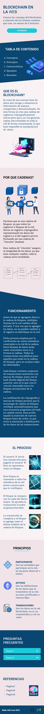

# Welcome to ucom-html-1 👋


This repo represents the `Exercise 2` from the Systems Analysis degree of the UCOM University HTML5 & CSS Introduction! Feel free to fork it (for any reason xD) and play with it.

This project has design & functionality limitations by the Exercise itself...


### ✨ Demo (WIP)
Not available yet but Project `Mockup` is attached 4 now. `(Click to expand)`



##  Prerequisites
 - Docker 24.x

##  Getting Started - Development Server
To serve the project on port 3000 run:
```bash
  make build run
```

Clean Steps:
```bash
  make clean 
```

Start a terminal:
```bash 
  make terminal
```

Clean start with:
```bash
  make clean build run
```

## Author

👤 **Domenic-MZS <domenicoenriquemeza20014@gmail.com>**

- Github: [@Domenic-MZS](https://github.com/Domenic-MZS)

## 🤝 Contributing

Contributions, issues and feature requests are welcome!

Feel free to check the [issues page](https://github.com/Domenic-MZS/ucom-html-1/issues). 
For the time being there's no request TEMPLATES nor GUIDELINES, so feel free to make the first step and say hello!

## Acknowledgment
Some cool stuff... Go give them some love !
 - [Docker](https://www.docker.com/)
 - [nginx](https://www.nginx.com/)
 - [Make](https://makefile.site/)
 - [UCOM](https://ucom.edu.py/)
 - [Shields.io](https://shields.io)

---
